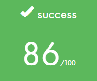

# wethinkcode_ Johannesburg

## examshell

Weekly exams

This is a collection of exam questions and answers for some of the examshell questions I completed while at wethinkcode_

Concepts tested:
- Algorithms
- String Handling
- Data Structures
- Data Types
